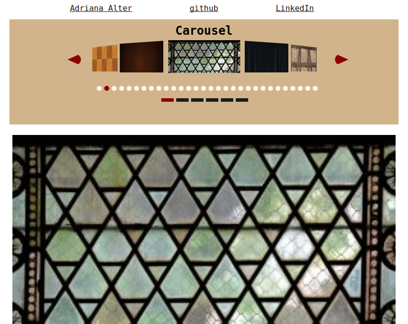

#Carousel

The carousel is a reusable React.js component.  It needs to be initialized with an array of file names, which will form the slides; at the top of the carousel.jsx file, just change the variable assignment for "ARRAY" to point to whatever array you would like to use.

</img>

To see a demo of the carousel, click <a href="https://adrianaalter.github.io/Carousel/">here</a>.
